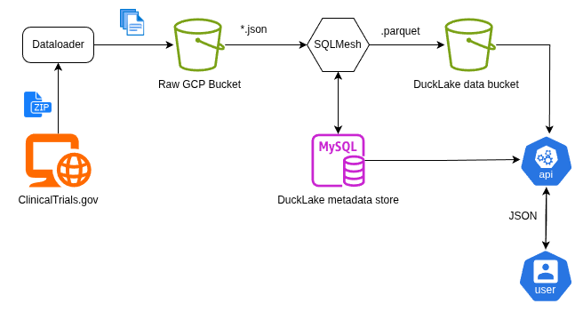

## Overview



This primary objective of this project is to extract large corpus of raw `.json` data from a datasource ([ClinicalTrials.gov](https://clinicaltrials.gov/data-api/about-api/api-migration#other-all-public-xml) in this case), apply data transformations using `SQLMesh` and `DuckLake`, and then load the processed data to `Google Cloud Bucket`. 

The users can then query the processed data using REST APIs provided by a `Google Cloud Run` service.


# Architecture

1. The entrypoint of the pipeline start with [dataloader script](dataloader/ingest.py) which extracts compressed data from the source, uncompresses the data and uploads to Google Cloud Bucket, let's say `raw`. This a standalone pipeline and can be run independently.

2. The next logical step is the data transformation and loading. This is handled by [SQLMesh project](etl/). SQLMesh does the following:
    - Uses `DuckDB` to extract the `json` data from `raw` Google Cloud Bucket.
    - Apply data transformation to remove unnecessary fields, apply sanitization etc.
    - Then uses `DuckLake` extension to load the the processed data in `.parquet` files to another Google Cloud Bucket, say `ducklake`.

4. DuckLake uses 2 data stores: 
    1. A transactional database (MySQL is used here) to store the metadata.
    2. An object store (Google Cloud Bucket in this case) to store the actual data files.

5. The processed data can then be queried using the [FastAPI service](api/), which connects to the `DuckLake` via `DuckDB`.


# Setup instructions

> This project uses various Google Cloud services, some of which may require enabling the APIs. Make sure you have an active Google Cloud Account with admin privileges.

1. Enable the following apis before provisioning any resource:
    1. Google Cloud Storage
    1. Google Artifact Registery
    1. Google Cloud Run
2. Authentication with GCP:
    1. Install [gcloud SDK](https://cloud.google.com/sdk/docs/install) if not already installed.
    2. Authenticate:
    ```bash
    gcloud auth application-default login
    gcloud config set project YOUR_PROJECT_ID
    ```
3. All the required services can be provisioned using Terraform. Make sure it is [installed](https://developer.hashicorp.com/terraform/install).
4. Step by step instruction to operate each part is listed below: 
    1. [Provision resources](infra/README.md).
    2. [Run the dataloader scipt](dataloader/README.md).
    3. [Run the SQLMesh project](etl/README.md).
    4. [Run the FastAPI server](api/README.md).


